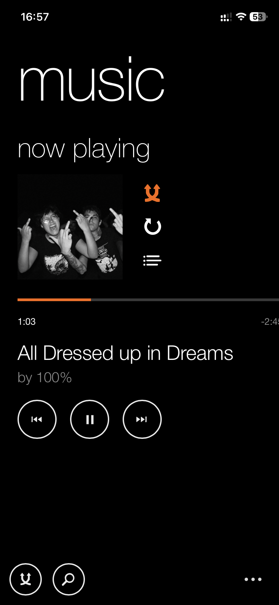
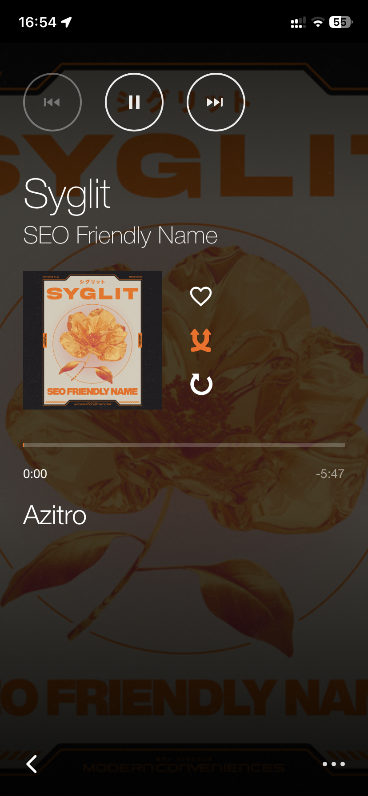
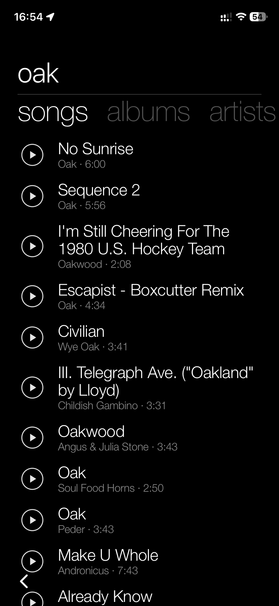
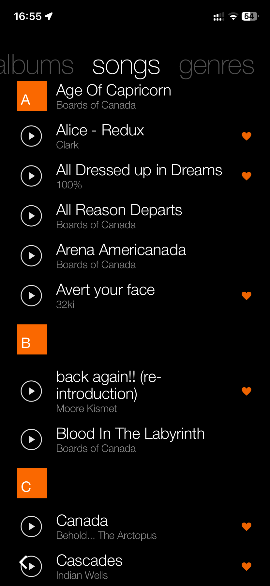
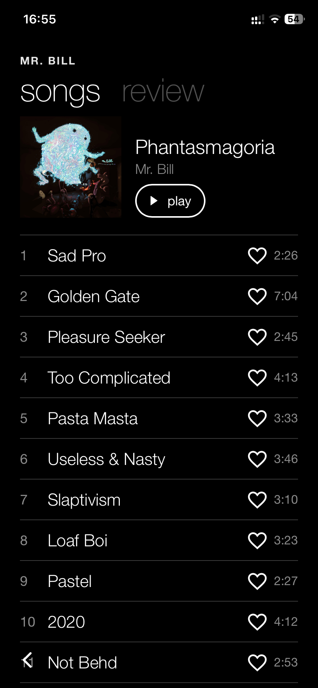
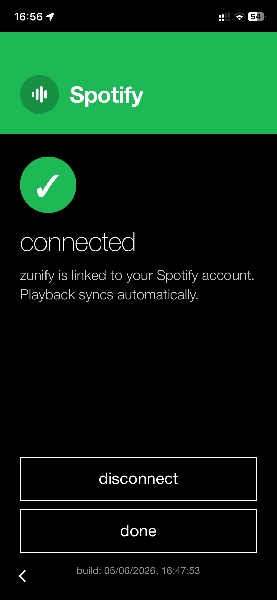

# zunify

<p align="center">
  <strong>A Metro-style Spotify player for the web.</strong>
</p>

<p align="center">
  Browse your library, search Spotify, control playback, and install it like a mobile app.
</p>

<p align="center">
  
  
  
  
</p>

---

## Screenshots

| Home | Player | Search |
| --- | --- | --- |
|  |  |  |

| Library | Album / Playlist | Settings |
| --- | --- | --- |
|  |  |  |

---

## What Is This?

zunify is a Spotify-powered progressive web app with a mobile-first, Windows Phone 8 Metro-inspired interface. It exists because the official Spotify app has become too bloated, crowded, and over-designed for people who just want their music library, search, and playback controls to be fast and calm.

It is also still hacky as hell. Expect rough edges, sharp corners, and the occasional "why did it do that?" moment.

It uses Spotify OAuth with PKCE, stores the Spotify Client ID locally in your browser, and talks directly to Spotify's Web API and Web Playback SDK.

A Spotify Premium account is required for playback control through Spotify's Web Playback SDK.

Main stuff:

- Library, playlists, albums, artists, and tracks.
- Spotify search.
- Playback controls and now-playing state.
- PWA install for phone use.

## Use Without Deploying

No clone, build, or deploy needed.

1. Open the live app:

```text
https://spotify-metro.je09.workers.dev/
```

2. Create a Spotify app at <https://developer.spotify.com/dashboard>.
3. In that Spotify app, add this redirect URI exactly:

```text
https://spotify-metro.je09.workers.dev/
```

4. Copy the Client ID.
5. Open zunify settings.
6. Paste the Client ID.
7. Click `agree`.

The Client ID and Spotify tokens stay in your browser storage.

## Install As A PWA

zunify can be added to your home screen and used like a standalone app.

### iPhone / iPad

1. Open <https://spotify-metro.je09.workers.dev/> in Safari.
2. Tap the share button.
3. Tap `Add to Home Screen`.
4. Confirm with `Add`.
5. Open zunify from the new home-screen icon.

Use Safari for installation.

### Android

1. Open <https://spotify-metro.je09.workers.dev/> in Chrome.
2. Tap the three-dot menu.
3. Tap `Add to Home screen` or `Install app`.
4. Confirm the install.
5. Open zunify from your launcher.

## Setup

### 1. Install Dependencies

```bash
npm install
```

### 2. Create A Spotify App

1. Create a Spotify app at <https://developer.spotify.com/dashboard>.
2. Copy the Client ID.
3. Add this redirect URI:

```text
http://localhost:5173/
```

### 3. Run Locally

```bash
npm run dev
```

Open:

```text
http://localhost:5173/
```

Then paste the Client ID in zunify settings and authorize Spotify.

## Scripts

| Command | Purpose |
| --- | --- |
| `npm run dev` | Start local Vite dev server. |
| `npm run build` | Type-check and build production assets. |
| `npm run lint` | Run ESLint. |
| `npm run test` | Run Vitest tests. |
| `npm run quality` | Run lint, build, and tests. |
| `npm run deploy` | Build and deploy with Wrangler. |

## Tech Notes

- Built with React 19 and Vite 8.
- Navigation uses a small in-app stack. Previous screens stay buffered with React `Activity`, so going back preserves scroll position and loaded list state without manually restoring pixels.

## Deploy

This repo is configured for Cloudflare Workers assets through `wrangler.jsonc`.

```bash
npm run deploy
```

After deploy, add the deployed origin with a trailing slash to your Spotify app redirect URIs.

## Privacy

zunify does not need a backend for Spotify auth. Tokens and the Client ID live in the browser. Disconnect from inside the app or revoke access from your Spotify account settings at any time.

## But That's Just AI Slop

Yes.
